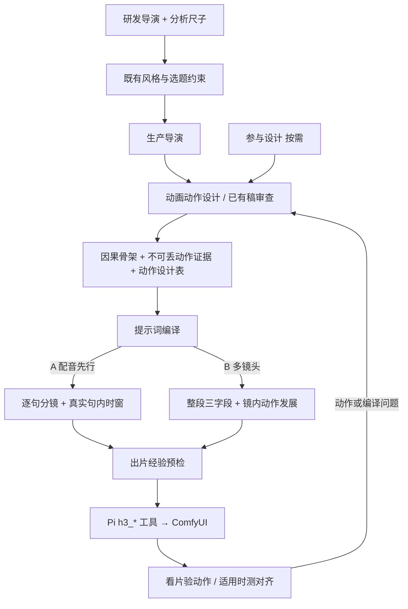

# H3 Production Skills

面向 **H3-pi-agent + ComfyUI** 的8项通用视频生产技能。

本项目管理分析、动画动作设计、提示词编译、逐句分镜、经验预检、参与设计和导演编排。核心是让动画的因果、可见过程与后果在下游提示词中保留下来。它是技能库；运行视频仍需要配置好的H3-pi-agent、相应生产桥和ComfyUI工作流。

## 技能清单

| 技能 | 版本 | 作用 |
|---|---|---|
| [h3-director](skills/h3-director/SKILL.md) | 1.6.0 | 生产导演，调度技能、工具、验收与交付 |
| [h3-research-director](skills/h3-research-director/SKILL.md) | 2.9.0 | 分析参考，提炼主配方、动作机制及研发交接 |
| [creative-animation-treatment](skills/creative-animation-treatment/SKILL.md) | 2.2.0 | 设计因果、动作证据、材料反应与连续性 |
| [style-foundations](skills/style-foundations/SKILL.md) | 1.7.0 | 通用分析尺度，区分测量与导演表达 |
| [h3-prompt-writing](skills/h3-prompt-writing/SKILL.md) | 1.7.0 | 官方字段语法与保留动作证据的本地编译 |
| [h3-storyboard-writing](skills/h3-storyboard-writing/SKILL.md) | 1.8.0 | 配音先行A线的逐句动作、时窗与工具映射 |
| [h3-production-lessons](skills/h3-production-lessons/SKILL.md) | 1.5.0 | 在样本范围内复用实测，分开假设与待测修法 |
| [participation-design](skills/participation-design/SKILL.md) | 1.2.0 | 按需设计预测、等待与揭晓，支持局部短片 |

## 配合方式



独立风格与选题技能是外部输入，此仓库未收录。它们的哲学、本质、旁白和选题约束仍优先。通用技能不能自行把极简风格换成复杂场景。

## 获取与接入

```powershell
git clone https://github.com/liujiangmu123/h3-production-skills.git
```

每个 `skills/<name>` 都是完整技能目录，包含 `SKILL.md` 和按需参考。通用读取型Agent可以直接使用这些目录；实际调用H3生产工具需要对应运行环境。

H3-pi-agent通过配置的技能安装根读取文件。可按已用版本的 `h3_skill` 管理流程先验证，再打包并显式安装；不要用本仓库覆盖整个既有技能库。[接入说明](docs/integration.md) 列出路径和依赖边界。

维护时先改本仓库、验证，再同步到生产安装根。不要同时把源目录和安装副本各改一遍。`skills-manifest.json` 记录本次导出的版本和逐文件SHA256。

## 验证范围

```powershell
python scripts/verify_bundle.py
```

只用Python标准库，检查8个目录、文件哈希、文件集合和本技能内部参考。源库的H3验证、安装同步与独立文字试验已完成；本轮没有GPU出片，所以不宣称模型变形、跨段身份或成片审美已验证。

详见 [优化记录](docs/optimization.md) 和 [来源说明](THIRD_PARTY_NOTICES.md)。仓库不包含模型权重、软件环境、凭据或实际分镜台工程。
